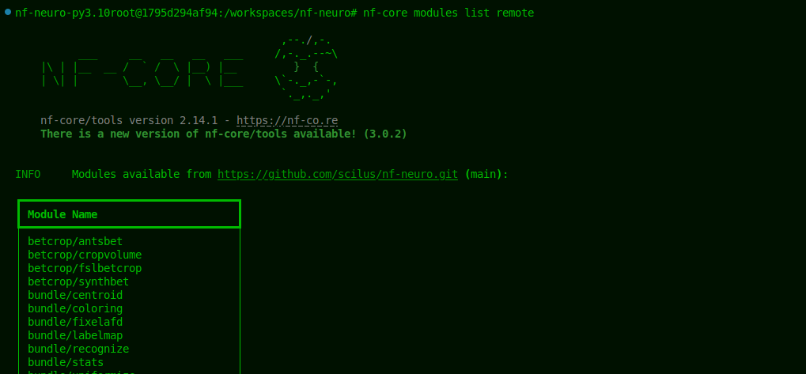
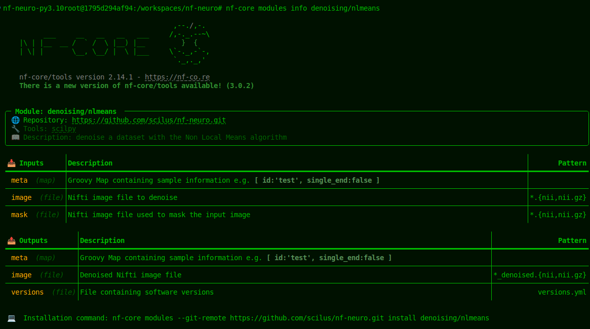
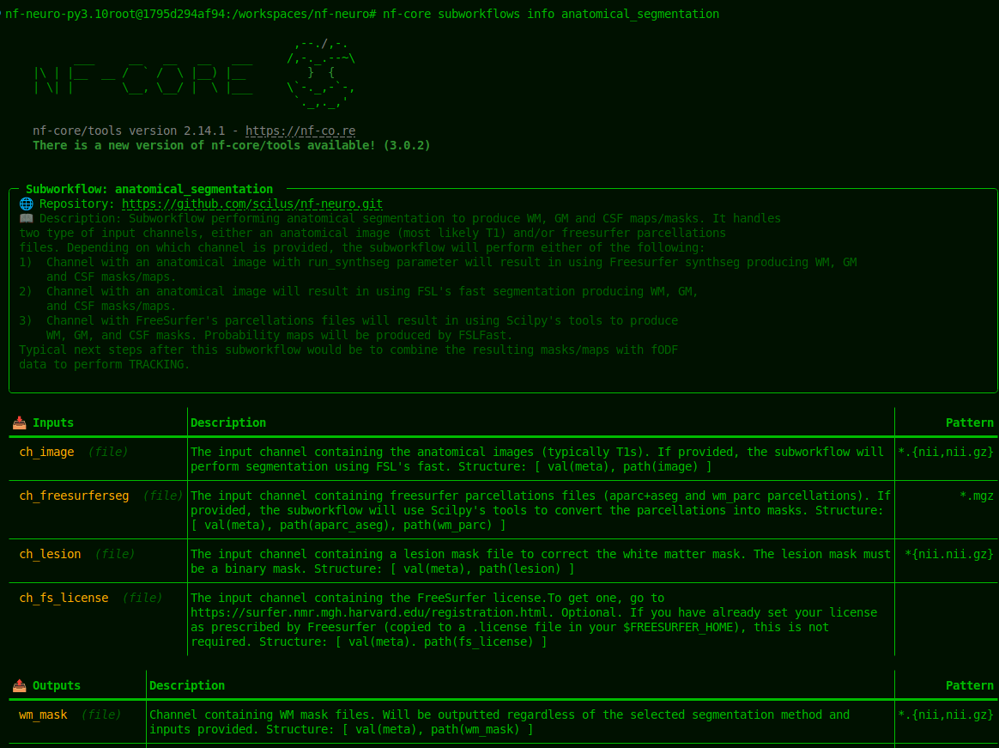

<p align="center">
  
</p> <!-- omit in toc -->
<p align="center">
  
</p> <!-- omit in toc -->

[](https://www.nextflow.io/)
[](https://pycqa.github.io/nf-core/)
[](https://www.docker.com/)
[](https://sylabs.io/docs/)


Welcome to the `nf-neuro` project ! A **Nextflow** modules and workflows repository for neuroimaging
maintained by the [SCIL team](https://scil-documentation.readthedocs.io/en/latest/). The
primary focus of the library is to provide pre-built processes and processing sequences for
**neuroimaging**, optimized for _Nextflow DSL2_, based on open-source
technologies and made easily available to pipeline's developers through the `nf-core`
framework.

# WHY ? `nf-neuro`<!-- omit in toc -->

**Let's say you develop a pipeline for neuroimaging**. You want to make it the more _efficient,_
_reliable, reproducible_ and also be able to _evaluate it_ and _control the quality_ of its outputs.
That's what `nf-neuro` provides to you, **all in one repository**, hosting **all dependencies** you
need to start developing and analyzing.

The only thing we ask of you is to develop in `Nextflow DSL2`. We use principle and standards
closely aligned with [nf-core](), but we'll make you adapt to them slowly as you go (we still
haven't finished complying to all of them ourselves). Using `nf-neuro` helps accelerate
development in **neuroimaging** and produces better research outcomes for all !

# Where do I start ?<!-- omit in toc -->

Well, it depends on what you want to do. If you want to :

- **Learn about the modules and subworkflows** in `nf-neuro`, go to the [discovery](#discovering-nf-neuro) section.
- **Create a new pipeline quickly**, using **modules** and **subworkflows** from `nf-neuro`, go to the
  [prototyping](./docs/PROTOTYPING.md) section.
- **Create or publish a production pipeline** branded with `nf-neuro`, go to the
  [porting prototypes](./docs/PRODUCTION.md) section.
- **Contribute new modules and subworkflows** to `nf-neuro`, go to the
  [contribution](#contributing-to-the-nf-neuro-project) section.

---

- [Discovering `nf-neuro`](#discovering-nf-neuro)
  - [Getting info on components from `nf-neuro`](#getting-info-on-components-from-nf-neuro)
- [Pipeline creation with `nf-neuro`](#pipeline-creation-with-nf-neuro)
  - [Prototyping using components from `nf-neuro`](#prototyping-using-components-from-nf-neuro)
  - [Porting prototypes to `nf-` ready pipelines](#porting-prototypes-to-nf--ready-pipelines)
- [Contributing to the `nf-neuro` project](#contributing-to-the-nf-neuro-project)
- [Running tests](#running-tests)

---

# Discovering `nf-neuro`

To get information on `nf-neuro` components, you'll first need to install `python` and `nf-core`. We provide
extensive guidelines to do it in [this guide](./docs/environment/NFCORE.md).

## Getting info on components from `nf-neuro`

With your environment ready, you can list `nf-neuro` modules available with a simple command :

```bash
nf-core modules list remote
```

<p align="center">
  
</p> <!-- omit in toc -->

The same goes for `subworkflows` :

```bash
nf-core subworkflows list remote
```

<p align="center">
  
</p> <!-- omit in toc -->

To get more information on a module (say `denoising/nlmeans`) use :

```bash
nf-core modules info denoising/nlmeans
```

<p align="center">
  
</p> <!-- omit in toc -->

or for a subworkflow (say `preproc_t1`) :

```bash
nf-core subworkflows info preproc_t1
```

<p align="center">
  
</p> <!-- omit in toc -->

> [!NOTE]
> Additionally, `VS Code` users can install the [nextflow extension](https://marketplace.visualstudio.com/items?itemName=nextflow.nextflow),
> which contains a language server that helps you in real time when coding. It gives you useful tooltips on modules inputs and outputs, commands
> to navigate between modules and workflows and highlights errors. For sure, you get all that for free if you use the `devcontainer` !

> [!IMPORTANT]
> The `nextflow language server` is a precious resource that will help you resolve most exceptions existing within the metadata
> description of modules and workflows prescribed by `nf-core` and shown below. Thus, we highly recommend its use.

You'll get a good description of the modules's or subworkflow's `behavior` and `dependencies`, as well as a
thorough description of its `inputs` and `outputs`.

# Pipeline creation with `nf-neuro`

## [Prototyping using components from `nf-neuro`](./docs/PROTOTYPING.md)

## [Porting prototypes to `nf-` ready pipelines](./docs/PRODUCTION.md)

# Contributing to the `nf-neuro` project

> [!IMPORTANT]
> First, follow the [devops guide](./docs/environment/DEVOPS.md) to setup your
> `development environment` or check if your current one meets the requirements.

`nf-neuro` accepts contribution of new **modules** and **subworkflows** to its library. You'll need first to
[setup your environment](./docs/DEVOPS.md), for which we have devised clever ways to streamline the procedure.
Then, depending on which kind of component you want to submit, you'll either need to follow the [module creation](./docs/MODULE.md)
or the [subworkflow creation](./docs/SUBWORKFLOWS.md) guidelines. Components that don't abide to them won't be accepted
and PR containing them will be closed automatically.

# Running tests

Tests are run through `nf-core`, using the command :

```bash
nf-core modules test <category/tool>
```

The tool can be omitted to run tests for all modules in a category.
